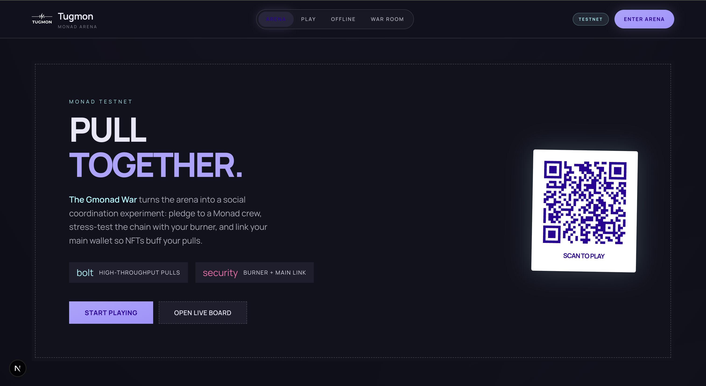
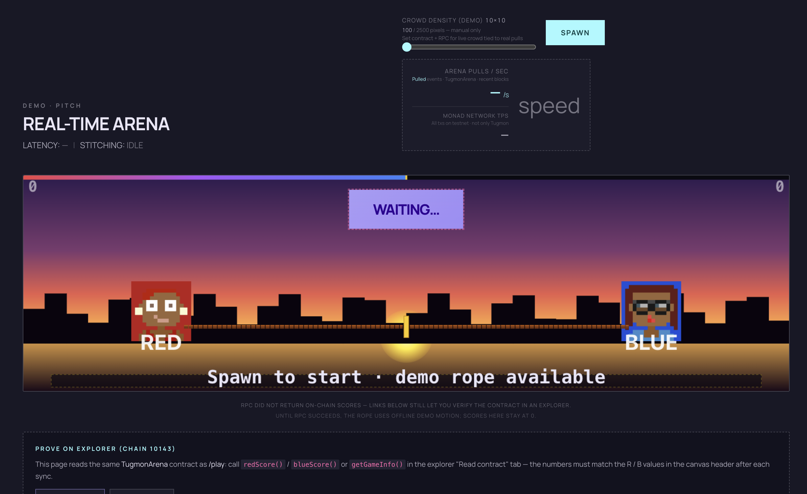
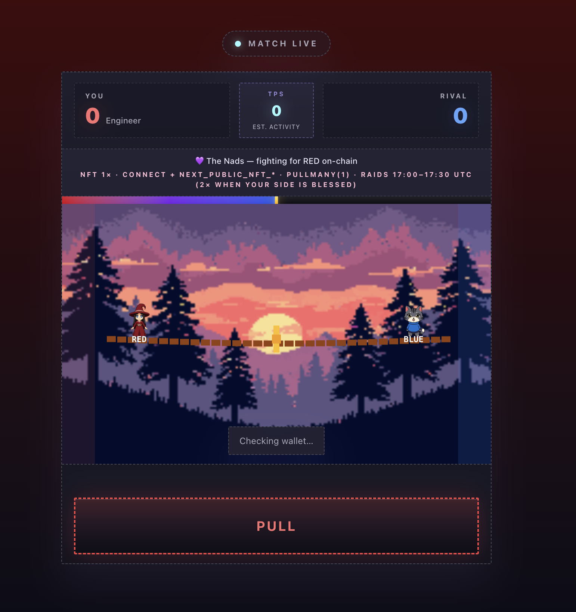

# Tugmon — Monad Arena

**Tugmon** is a mobile-first, on-chain **social coordination game** on **Monad testnet** (chain ID **10143**). Players join **Red** or **Blue**, pledge to a **Gmonad crew** for identity and stats, and send high-frequency **`pull`** transactions through a **burner wallet**—optionally linking a **main wallet** so holding crew NFTs **buffs** pulls via batched **`pullMany`** calls. A **War Room** dashboard and landing arena visualize live scores, community pull totals, and network activity.

The experience is framed as **The Gmonad War**: stress-test the chain with throughput-friendly gameplay while crews compete for on-chain bragging rights.

---

## Screenshots

| Landing & narrative | Real-time arena demo | Live match (play UI) |
| --- | --- | --- |
| [](readme1.png) | [](readme2.png) | [](readme3.png) |

- **Landing (`/`):** “Pull together” hero, crew narrative, high-throughput + burner/main positioning, QR to **Scan to play**.
- **Arena:** Pixel tug-of-war board, **Arena pulls/sec** (from `TugmonArena` events), **Monad network TPS** snapshot, optional offline demo rope when RPC reads fail.
- **Play (`/play`):** Match HUD, role (e.g. Engineer), TPS-style activity, **Pull** CTA, raid/NFT hints in the UI.

---

## What’s in this repo

| Path | Role |
| --- | --- |
| **`web/`** | Next.js (App Router) — landing, arena, play, dashboard (War Room), `/api/fund`, `/api/game-scores`, `/api/community-stats`, PWA |
| **`contracts/`** | Hardhat — `TugmonArena.sol`, deploy script, tests |
| **`scripts/`** | e.g. `deploy-vercel.sh` for production deploys |

---

## Core gameplay (on-chain)

Smart contract: **`TugmonArena`** (`contracts/contracts/TugmonArena.sol`).

### Teams and joining

- **Teams:** `1` = Red, `2` = Blue (chosen at join).
- **`join(team, communityId, nickname)`** — one-time; assigns a random **role**:
  - **Engineer** — base pull weight **2** (others **1**).
  - **Booster** — **`boost()`** applies a short **2×** pull multiplier window for your team.
  - **Saboteur** — **`sabotage()`** briefly blocks the **enemy** team from pulling.

### Pulling and scoring

- **`pull()`** — single scoring step; emits **`Pulled`** with updated global scores.
- **`pullMany(n)`** — same logic in one transaction for `n` in `1..32` (used by the client when NFT + raid multipliers increase “burst” size).

Scores reset automatically when **`GAME_DURATION`** (1 minute in the default contract) elapses since **`lastReset`**, or via **`resetGame()`**.

### Crews (Gmonad communities)

**`communityId`** on-chain is **independent** of Red/Blue—it labels allegiance for analytics and UI:

| `communityId` | Crew |
| ---: | --- |
| 1 | The Nads |
| 2 | Molandaks |
| 3 | Monad Nomads |
| 4 | Chads vs Soyjaks |

Frontend mapping lives in `web/src/utils/gmonadCommunities.ts`.

---

## Wallets: burner + main

### Burner (session wallet)

- Used for **actual transactions** (`join`, `pull`, `pullMany`, `boost`, `sabotage`) so players are not forced to install a browser extension for basic demo play.
- **Modes** (`NEXT_PUBLIC_BURNER_WALLET_MODE`):
  - **`deterministic`** (default) — private key derived from the display name (`web/src/lib/burnerWallet.ts`): same name ⇒ same address on any device.
  - **`random`** — `Wallet.createRandom()` persisted in `localStorage` (closer to classic “ephemeral burner” UX).

### Main wallet (optional)

- Stored via `web/src/lib/mainWallet.ts` after **Connect** (EIP-1193).
- **Not** required to pull; used to prove **ERC-721 balance** for the player’s crew collection so the UI can apply **`pullMany`** burst sizing (`web/src/lib/nftPowerUp.ts`).

### Faucet

- **`POST /api/fund`** sends test **MON** to underfunded burners using **`FUNDING_PRIVATE_KEY`**.
- Rate limits: per-address cooldown; optional per-IP cap; **Upstash Redis** when configured (otherwise in-memory, fine for single-instance dev).

---

## NFT buffs and raids (client-side multipliers)

These affect **how many on-chain pulls** a single button press batches via **`pullMany`**, not the per-pull formula inside Solidity.

- **NFT:** If `NEXT_PUBLIC_NFT_<CREW>` is set to a valid ERC-721 contract and the linked main wallet has **`balanceOf ≥ 1`**, a multiplier is applied (`NEXT_PUBLIC_NFT_MULTIPLIER`, default **2**, capped sanely in `web/src/utils/pullBurst.ts`).
- **Raid window:** Default **17:00–17:30 UTC** daily; the “blessed” side gets **2×** burst contribution when aligned (`web/src/utils/raidSchedule.ts`). Disabled with **`NEXT_PUBLIC_RAIDS_ENABLED=0`**. Custom hours via **`NEXT_PUBLIC_RAID_START_UTC_HOUR`** / **`NEXT_PUBLIC_RAID_END_UTC_HOUR`** (and minute variants).

**Important:** The dashboard and play views show **estimated activity** (events processed in-session, last-block tx sampling, etc.)—not Monad’s official global TPS label. See the note in the original README section below.

---

## Web app routes

| Route | Purpose |
| --- | --- |
| **`/`** | Landing + embedded **Arena** (client-only component) |
| **`/play`** | Nickname, fund flow, join, main canvas / tug UI |
| **`/play/offline`** | Local-only demo (no chain) |
| **`/dashboard`** | War Room — score bar, QR to play, community stats hooks |

---

## Metrics & verification

- **On-chain reads:** `redScore()`, `blueScore()`, `getGameInfo()`, `getPlayerInfo(address)` — verify against explorers for **chain 10143**.
- **`/api/game-scores`** — server-side contract reads for the landing header scores.
- **`/api/community-stats`** — aggregates **`Pulled`** logs + `playerCommunity` to rank crew pull totals (RPC-heavy; tuned with env chunking vars in `web/.env.example`).

If RPC fails, the **Arena** canvas can fall back to **offline demo** motion while still linking explorer URLs for contract proof (as in the arena screenshot).

---

## Tech stack

- **Frontend:** Next.js 16, React 19, TypeScript, Tailwind CSS 4, Framer Motion, ethers v6
- **Contract:** Solidity **0.8.24**, Hardhat
- **PWA:** `web/src/app/manifest.ts`, service worker under `web/public/sw.js`

Visual design direction is documented in **`DESIGN.md`** (“Hyper-Speed Atelier” / kinetic editorial style).

---

## Prerequisites

- Node.js (LTS recommended)
- npm
- For testnet: Monad testnet **MON** for deployer + faucet wallet

---

## Environment variables

Copy examples and fill secrets locally (never commit real keys):

```bash
cp web/.env.example web/.env.local
cp contracts/.env.example contracts/.env   # optional, for deploy
```

### `web/.env` essentials

| Variable | Purpose |
| --- | --- |
| `NEXT_PUBLIC_RPC_URL` | Monad (or local) JSON-RPC |
| `NEXT_PUBLIC_CHAIN_ID` | e.g. `10143` |
| `NEXT_PUBLIC_CONTRACT_ADDRESS` | Deployed `TugmonArena` |
| `NEXT_PUBLIC_APP_URL` | Canonical origin (QR codes, links) |
| `NEXT_PUBLIC_EXPLORER_URL` | Block explorer base URL |
| `NEXT_PUBLIC_BURNER_WALLET_MODE` | `deterministic` (default) or `random` |
| `FUNDING_PRIVATE_KEY` | Faucet signer (server only) |
| `FUNDING_*` | Amount, min balance, cooldowns, optional IP caps |
| `UPSTASH_REDIS_REST_URL` / `_TOKEN` | Durable rate limits (optional) |

**Optional gameplay / tuning:** see full `web/.env.example` for log scan windows, TPS cache, **`CONTRACT_DEPLOY_BLOCK`**, and RPC throttles.

**NFT collections (optional):**

- `NEXT_PUBLIC_NFT_NADS`, `NEXT_PUBLIC_NFT_MOLANDAKS`, `NEXT_PUBLIC_NFT_NOMADS`, `NEXT_PUBLIC_NFT_CHADS_SOYJAKS` — ERC-721 addresses per crew.

### `contracts/.env`

| Variable | Purpose |
| --- | --- |
| `PRIVATE_KEY` | Deployer for `monadTestnet` |
| `MONAD_RPC_URL` | RPC for deploy |

---

## Local development

### 1. Contracts

```bash
cd contracts
npm install
npx hardhat test
```

Optional local node:

```bash
npx hardhat node
# another terminal:
npx hardhat run scripts/deploy.js --network localhost
```

Point `web/.env.local` at `http://127.0.0.1:8545` and set `NEXT_PUBLIC_CONTRACT_ADDRESS` to the printed address.

### 2. Web app

```bash
cd web
npm install
npm run dev
```

Open [http://localhost:3000](http://localhost:3000). Use **`/play`** on a phone and **`/dashboard`** on a large display.

### 3. Production build

```bash
cd web && npm run build && npm start
```

---

## Deploy

### Smart contract (Monad testnet)

1. Fund the deployer with test MON.
2. Set `contracts/.env` (`PRIVATE_KEY`, `MONAD_RPC_URL`).
3. Run:

   ```bash
   cd contracts
   npx hardhat run scripts/deploy.js --network monadTestnet
   ```

4. Put the deployed address in **`NEXT_PUBLIC_CONTRACT_ADDRESS`** and set **`CONTRACT_DEPLOY_BLOCK`** / **`NEXT_PUBLIC_CONTRACT_DEPLOY_BLOCK`** if you use community stats APIs.

### Frontend (Vercel)

Configure host env vars (`FUNDING_PRIVATE_KEY`, RPC, contract address, `NEXT_PUBLIC_APP_URL`, optional Upstash).

From repo root you can use:

```bash
cd web && npm run deploy:vercel
```

(which wraps `scripts/deploy-vercel.sh`). Adjust project linkage in that script if you use a different Vercel project name.

---

## PRD vs this repo (TPS & burner)

The product once specified a random burner in `localStorage` and a headline “TPS” tied naively to chain throughput. This implementation:

- Defaults to a **deterministic** session key from the display name; set **`NEXT_PUBLIC_BURNER_WALLET_MODE=random`** for PRD-style behavior.
- Treats dashboard “activity” as **estimated activity** (contract events in the browser session + optional **RPC snapshot** of tx volume in the latest block)—**not** Monad’s global official TPS metric.

---

## Scripts reference

| Location | Command | Meaning |
| --- | --- | --- |
| `web/` | `npm run dev` | Next.js dev server |
| `web/` | `npm run build` | Production build |
| `web/` | `npm run deploy:vercel` | Deploy via Vercel CLI (see script) |
| `contracts/` | `npm test` | Hardhat tests |

---

## License

No explicit SPDX file is set in the repo root; treat as **hackathon / demo** unless you add a license.
